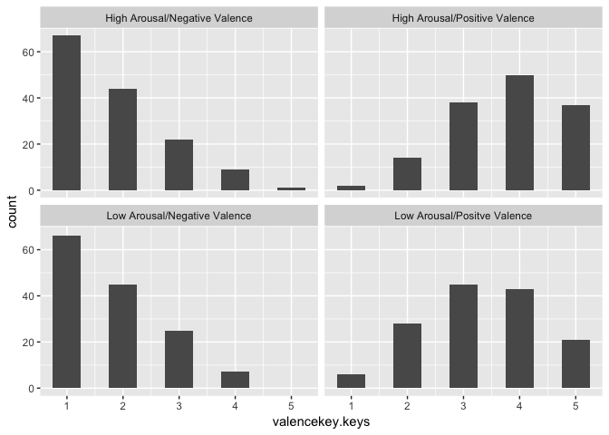
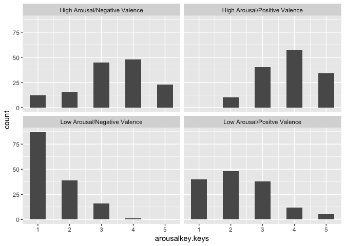
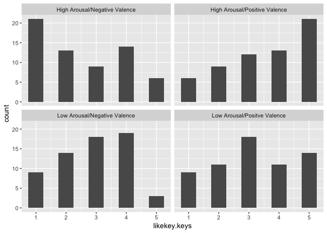
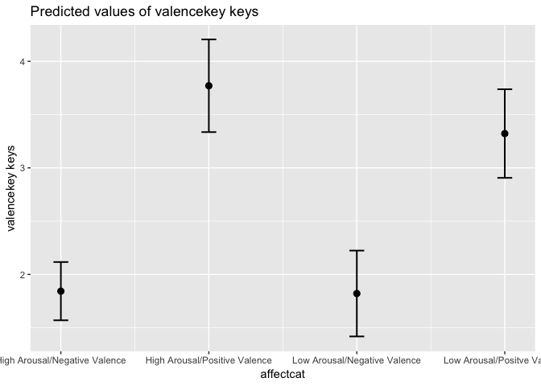
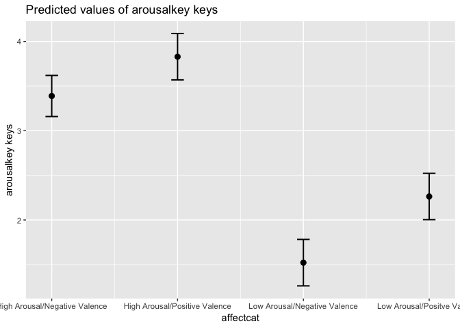

First 19 Participants
================

Peek at data to check range of scores and main effect of song condition.
Checking range out of concerns regarding variance for alexithymia
moderation

``` r
knitr::opts_chunk$set(echo = TRUE)
library(tidyverse)
library(readbulk)
library(psych)
library(afex)
library(knitr)
library(emmeans)
devtools::install_github("crsh/papaja")
library(sjPlot)
```

# Load in data

``` r
first19 <- readbulk::read_bulk(directory = "First19Data", fun = read_csv)

first19 <- unite(first19, 
                 id_trial,
                 participant, songtrials.thisN,
                 remove = FALSE)

first19 <- first19 %>% mutate(.,
                              affectcat = as.factor(recode(affectcat,
                                                           "1" = "High Arousal/Positive Valence",
                                                           "2" = "High Arousal/Negative Valence",
                                                           "3" = "Low Arousal/Negative Valence",
                                                           "4" = "Low Arousal/Positve Valence")),
                              arousal = as.factor(recode(arousal, 
                                                         "1" = "Low",
                                                         "2" = "high")),
                              valence = as.factor(recode(valence,
                                                         "1" = "Negative",
                                                         "2" = "Positive")))
```

``` r
head(first19)
```

    ##                                  Instruction    Word song valence arousal
    ## 1                                       <NA>    <NA> <NA>    <NA>    <NA>
    ## 2                                       <NA>    <NA> <NA>    <NA>    <NA>
    ## 3                                       <NA>    <NA> <NA>    <NA>    <NA>
    ## 4                                       <NA>    <NA> <NA>    <NA>    <NA>
    ## 5 To what extent did the music make you feel ASHAMED <NA>    <NA>    <NA>
    ## 6 To what extent did the music make you feel   ALERT <NA>    <NA>    <NA>
    ##   affectcat songmark pracwords.thisRepN pracwords.thisTrialN
    ## 1      <NA>       NA                 NA                   NA
    ## 2      <NA>       NA                 NA                   NA
    ## 3      <NA>       NA                 NA                   NA
    ## 4      <NA>       NA                 NA                   NA
    ## 5      <NA>       NA                  0                    0
    ## 6      <NA>       NA                  0                    1
    ##   pracwords.thisN pracwords.thisIndex songtrials.thisRepN
    ## 1              NA                  NA                  NA
    ## 2              NA                  NA                  NA
    ## 3              NA                  NA                  NA
    ## 4              NA                  NA                  NA
    ## 5               0                   4                  NA
    ## 6               1                   8                  NA
    ##   songtrials.thisTrialN id_trial songtrials.thisN songtrials.thisIndex
    ## 1                    NA   001_NA               NA                   NA
    ## 2                    NA   001_NA               NA                   NA
    ## 3                    NA   001_NA               NA                   NA
    ## 4                    NA   001_NA               NA                   NA
    ## 5                    NA   001_NA               NA                   NA
    ## 6                    NA   001_NA               NA                   NA
    ##   words.thisRepN words.thisTrialN words.thisN words.thisIndex begin.keys
    ## 1             NA               NA          NA              NA     return
    ## 2             NA               NA          NA              NA       <NA>
    ## 3             NA               NA          NA              NA       <NA>
    ## 4             NA               NA          NA              NA       <NA>
    ## 5             NA               NA          NA              NA       <NA>
    ## 6             NA               NA          NA              NA       <NA>
    ##   begin.rt arousalkey.keys arousalkey.rt valencekey.keys valencekey.rt
    ## 1 19.35905              NA            NA              NA            NA
    ## 2       NA               5      4.202053              NA            NA
    ## 3       NA              NA            NA               5      3.450796
    ## 4       NA              NA            NA              NA            NA
    ## 5       NA              NA            NA              NA            NA
    ## 6       NA              NA            NA              NA            NA
    ##   likekey.keys likekey.rt WordResponse.keys WordResponse.rt
    ## 1           NA         NA                NA              NA
    ## 2           NA         NA                NA              NA
    ## 3           NA         NA                NA              NA
    ## 4            5   3.051111                NA              NA
    ## 5           NA         NA                 1        8.660583
    ## 6           NA         NA                 2        9.993466
    ##   key_resp_2.keys key_resp_2.rt participant session             date
    ## 1            <NA>            NA         001     001 2019_May_07_0907
    ## 2            <NA>            NA         001     001 2019_May_07_0907
    ## 3            <NA>            NA         001     001 2019_May_07_0907
    ## 4            <NA>            NA         001     001 2019_May_07_0907
    ## 5            <NA>            NA         001     001 2019_May_07_0907
    ## 6            <NA>            NA         001     001 2019_May_07_0907
    ##                           expName psychopyVersion        frameRate X38
    ## 1 MusicAffectPsychophysiology2019           3.0.5 59.9500871160595  NA
    ## 2 MusicAffectPsychophysiology2019           3.0.5 59.9500871160595  NA
    ## 3 MusicAffectPsychophysiology2019           3.0.5 59.9500871160595  NA
    ## 4 MusicAffectPsychophysiology2019           3.0.5 59.9500871160595  NA
    ## 5 MusicAffectPsychophysiology2019           3.0.5 59.9500871160595  NA
    ## 6 MusicAffectPsychophysiology2019           3.0.5 59.9500871160595  NA
    ##                                                       File X36   X7
    ## 1 001_MusicAffectPsychophysiology2019_2019_May_07_0907.csv  NA <NA>
    ## 2 001_MusicAffectPsychophysiology2019_2019_May_07_0907.csv  NA <NA>
    ## 3 001_MusicAffectPsychophysiology2019_2019_May_07_0907.csv  NA <NA>
    ## 4 001_MusicAffectPsychophysiology2019_2019_May_07_0907.csv  NA <NA>
    ## 5 001_MusicAffectPsychophysiology2019_2019_May_07_0907.csv  NA <NA>
    ## 6 001_MusicAffectPsychophysiology2019_2019_May_07_0907.csv  NA <NA>

``` r
#remove practice trial
filtered19 <- first19 %>% filter(valencekey.keys > 0 & arousalkey.keys > 0 & songmark > 0)

filtered19 <- filtered19 %>% select(participant,
                                    id_trial,
                                    Word,
                                    songmark,
                                    valence,
                                    arousal,
                                    affectcat,
                                    arousalkey.keys,
                                    valencekey.keys,
                                    likekey.keys,
                                    WordResponse.keys) 

names(filtered19)
```

    ##  [1] "participant"       "id_trial"          "Word"             
    ##  [4] "songmark"          "valence"           "arousal"          
    ##  [7] "affectcat"         "arousalkey.keys"   "valencekey.keys"  
    ## [10] "likekey.keys"      "WordResponse.keys"

``` r
filtered19 %>% select(arousalkey.keys, valencekey.keys, likekey.keys) %>% describeBy(group = filtered19$affectcat)
```

    ## 
    ##  Descriptive statistics by group 
    ## group: High Arousal/Negative Valence
    ##                 vars   n mean   sd median trimmed  mad min max range  skew
    ## arousalkey.keys    1 143 3.38 1.13      3    3.46 1.48   1   5     4 -0.47
    ## valencekey.keys    2 143 1.83 0.96      2    1.70 1.48   1   5     4  0.96
    ## likekey.keys       3  63 2.54 1.40      2    2.43 1.48   1   5     4  0.32
    ##                 kurtosis   se
    ## arousalkey.keys    -0.41 0.09
    ## valencekey.keys     0.11 0.08
    ## likekey.keys       -1.34 0.18
    ## -------------------------------------------------------- 
    ## group: High Arousal/Positive Valence
    ##                 vars   n mean   sd median trimmed  mad min max range  skew
    ## arousalkey.keys    1 141 3.82 0.88      4    3.86 1.48   2   5     3 -0.25
    ## valencekey.keys    2 141 3.75 1.00      4    3.83 1.48   1   5     4 -0.43
    ## likekey.keys       3  61 3.56 1.36      4    3.69 1.48   1   5     4 -0.47
    ##                 kurtosis   se
    ## arousalkey.keys    -0.75 0.07
    ## valencekey.keys    -0.54 0.08
    ## likekey.keys       -1.08 0.17
    ## -------------------------------------------------------- 
    ## group: Low Arousal/Negative Valence
    ##                 vars   n mean   sd median trimmed  mad min max range  skew
    ## arousalkey.keys    1 143 1.52 0.72      1    1.39 0.00   1   4     3  1.12
    ## valencekey.keys    2 143 1.81 0.90      2    1.70 1.48   1   4     3  0.78
    ## likekey.keys       3  63 2.89 1.14      3    2.92 1.48   1   5     4 -0.17
    ##                 kurtosis   se
    ## arousalkey.keys     0.21 0.06
    ## valencekey.keys    -0.40 0.07
    ## likekey.keys       -0.99 0.14
    ## -------------------------------------------------------- 
    ## group: Low Arousal/Positve Valence
    ##                 vars   n mean   sd median trimmed  mad min max range  skew
    ## arousalkey.keys    1 143 2.26 1.07      2    2.16 1.48   1   5     4  0.58
    ## valencekey.keys    2 143 3.31 1.08      3    3.32 1.48   1   5     4 -0.14
    ## likekey.keys       3  63 3.16 1.35      3    3.20 1.48   1   5     4 -0.09
    ##                 kurtosis   se
    ## arousalkey.keys    -0.27 0.09
    ## valencekey.keys    -0.74 0.09
    ## likekey.keys       -1.16 0.17

``` r
# #require(ggplot2)    
# p <- ggplot(data = df, aes(x=hour)) 
# p <- p + geom_histogram(aes(weights=count, fill=weekday))
# p <- p + scale_fill_brewer(palette="Set3")
# p <- p + facet_wrap( ~ weekday, ncol=1)
# p

filtered19 %>% ggplot(aes(x=valencekey.keys)) + geom_histogram(binwidth = .5)  +facet_wrap(~affectcat)
```

<!-- -->

``` r
filtered19 %>% ggplot(aes(x=arousalkey.keys)) + geom_histogram(binwidth = .5) +facet_wrap(~affectcat)
```

<!-- -->

``` r
filtered19 %>% ggplot(aes(x=likekey.keys)) + geom_histogram(binwidth = .5) +facet_wrap(~affectcat)
```

    ## Warning: Removed 320 rows containing non-finite values (stat_bin).

<!-- -->

``` r
names(filtered19)
```

    ##  [1] "participant"       "id_trial"          "Word"             
    ##  [4] "songmark"          "valence"           "arousal"          
    ##  [7] "affectcat"         "arousalkey.keys"   "valencekey.keys"  
    ## [10] "likekey.keys"      "WordResponse.keys"

``` r
filtered19 <- filtered19 %>% select(affectcat,
                                    valence,
                                    arousal,
                                    songmark,
                                    valencekey.keys,
                                    arousalkey.keys,
                                    likekey.keys,
                                    participant)

pilotmodelvalence <- afex::mixed(formula = valencekey.keys~affectcat + (1 |songmark) +(affectcat |participant), data = filtered19, return = "merMod") 
```

    ## Contrasts set to contr.sum for the following variables: affectcat

    ## Warning in checkConv(attr(opt, "derivs"), opt$par, ctrl =
    ## control$checkConv, : Model failed to converge with max|grad| = 0.00407996
    ## (tol = 0.002, component 1)

``` r
valenceplot <- plot_model(pilotmodelvalence, type = "eff")
```

    ## Package `effects` is not available, but needed for `ggeffect()`. Either install package `effects`, or use `ggpredict()`. Calling `ggpredict()` now.FALSE

``` r
print(valenceplot$affectcat)
```

<!-- -->

``` r
emmeans(pilotmodelvalence, "affectcat") %>% pairs() %>% kable(caption = "Pairwise comparisons of main effect of song affect category for valence ratings", digits = 3) 
```

| contrast                                                      | estimate |    SE |     df | t.ratio | p.value |
| :------------------------------------------------------------ | -------: | ----: | -----: | ------: | ------: |
| High Arousal/Negative Valence - High Arousal/Positive Valence |  \-1.927 | 0.270 | 22.535 | \-7.136 |   0.000 |
| High Arousal/Negative Valence - Low Arousal/Negative Valence  |    0.022 | 0.230 | 16.227 |   0.096 |   1.000 |
| High Arousal/Negative Valence - Low Arousal/Positve Valence   |  \-1.479 | 0.282 | 23.672 | \-5.236 |   0.000 |
| High Arousal/Positive Valence - Low Arousal/Negative Valence  |    1.949 | 0.280 | 23.446 |   6.971 |   0.000 |
| High Arousal/Positive Valence - Low Arousal/Positve Valence   |    0.448 | 0.240 | 18.142 |   1.870 |   0.275 |
| Low Arousal/Negative Valence - Low Arousal/Positve Valence    |  \-1.501 | 0.259 | 21.150 | \-5.801 |   0.000 |

Pairwise comparisons of main effect of song affect category for valence
ratings

``` r
pilotmodelarousal <- afex::mixed(formula = arousalkey.keys~affectcat + (1 |participant), data = filtered19, return = "merMod") 
```

    ## Contrasts set to contr.sum for the following variables: affectcat

``` r
arousalplot <- plot_model(pilotmodelarousal, type = "eff")
```

    ## Package `effects` is not available, but needed for `ggeffect()`. Either install package `effects`, or use `ggpredict()`. Calling `ggpredict()` now.FALSE

``` r
print(arousalplot$affectcat)
```

<!-- -->

``` r
emmeans(pilotmodelarousal, "affectcat") %>% pairs() %>% kable(caption = "Pairwise comparisons of main effect of song affect category for arousal ratings", digits = 0)
```

| contrast                                                      | estimate | SE |  df | t.ratio | p.value |
| :------------------------------------------------------------ | -------: | -: | --: | ------: | ------: |
| High Arousal/Negative Valence - High Arousal/Positive Valence |        0 |  0 | 549 |     \-4 |       0 |
| High Arousal/Negative Valence - Low Arousal/Negative Valence  |        2 |  0 | 549 |      19 |       0 |
| High Arousal/Negative Valence - Low Arousal/Positve Valence   |        1 |  0 | 549 |      11 |       0 |
| High Arousal/Positive Valence - Low Arousal/Negative Valence  |        2 |  0 | 549 |      23 |       0 |
| High Arousal/Positive Valence - Low Arousal/Positve Valence   |        2 |  0 | 549 |      16 |       0 |
| Low Arousal/Negative Valence - Low Arousal/Positve Valence    |      \-1 |  0 | 549 |     \-7 |       0 |

Pairwise comparisons of main effect of song affect category for arousal
ratings

\#Data Wrangling Emotion words

``` r
# forspread <- first19 %>% select(participant,
#                                 Word,
#                                 songmark,
#                                 WordResponse.keys,
#                                 id_trial) 
# 
# names(forspread)
# 
# sjmisc::to_wide
# spread19 <- forspread %>%  %>%  spread(key = Word, value = WordResponse.keys)
# 
# View(spread19)
```
