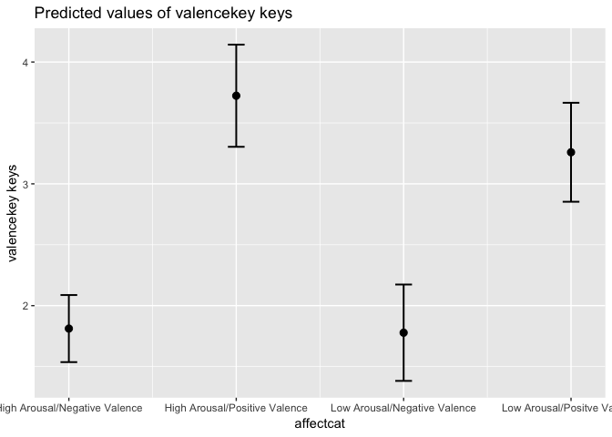
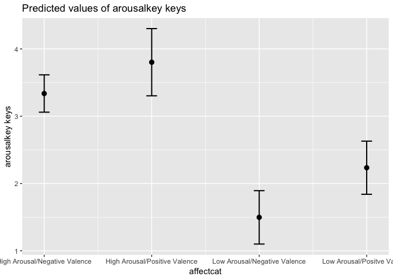

First 19 Participants
================

  - [Self Report Data](#self-report-data)
      - [Describe demographics](#describe-demographics)
      - [Affect ratings](#affect-ratings)
  - [Emotion Differentiation](#emotion-differentiation)
      - [Create list of words](#create-list-of-words)
  - [Cretae negative and postive song data sets and participant
    list](#cretae-negative-and-postive-song-data-sets-and-participant-list)
      - [Negative Stimuli](#negative-stimuli)
      - [Positive Stimuli](#positive-stimuli)
  - [Describe and Plot Valence](#describe-and-plot-valence)
  - [Describe and Plot Arousal](#describe-and-plot-arousal)

Peek at data to check range of scores and main effect of song condition.
Checking range out of concerns regarding variance for alexithymia
moderation

``` r
knitr::opts_chunk$set(echo = TRUE)
library(tidyverse)
library(readbulk)
library(psych)
library(afex)
library(knitr)
library(emmeans)
devtools::install_github("crsh/papaja")
library(sjPlot)
library(irr)
library(tableone)
devtools::install_github("ropenscilabs/gendercodeR")
library(gendercodeR)
```

# Self Report Data

``` r
selfreport <- read_csv("First19Data/first19Qual.csv") 
selfreport <- genderRecode(input=selfreport,
                           genderColName = "gender", 
                           method = "narrow",
                           outputColName = "gender_recode", 
                           missingValuesObjectName = NA,
                           customDictionary = data.frame(stringsAsFactors=FALSE,
       Input = c("girl/female"),
      Output = c("female")))

selfreport <- selfreport %>% filter (id < 20)
print(nrow(selfreport))
```

    ## [1] 19

## Describe demographics

``` r
selfreport %>% select(age, musichours) %>% describe() %>% kable(digits = 3)
```

|            | vars |  n |   mean |    sd | median | trimmed |   mad | min | max | range |  skew | kurtosis |    se |
| ---------- | ---: | -: | -----: | ----: | -----: | ------: | ----: | --: | --: | ----: | ----: | -------: | ----: |
| age        |    1 | 19 | 18.895 | 2.331 |     18 |  18.647 | 1.483 |  17 |  25 |     8 | 1.093 |    0.249 | 0.535 |
| musichours |    2 | 19 |  3.737 | 1.727 |      4 |   3.765 | 2.965 |   1 |   6 |     5 | 0.018 |  \-1.376 | 0.396 |

``` r
selfreport <- selfreport %>% mutate(yearsplay = as.factor(yearsplay) %>% recode("6" = "5+"))
CreateTableOne(vars = c("gender_recode", "yearsplay"), data = selfreport) %>% kableone()
```

|                           | Overall   |
| ------------------------- | :-------- |
| n                         | 19        |
| gender\_recode = male (%) | 2 (10.5)  |
| yearsplay (%)             |           |
| 0                         | 4 (21.1)  |
| 1                         | 1 ( 5.3)  |
| 2                         | 1 ( 5.3)  |
| 3                         | 2 (10.5)  |
| 5+                        | 11 (57.9) |

\#\#Create scores \#\#\#Alexithymia

``` r
selfreport <- selfreport %>% mutate(tas_4r = 6 - .$tas_4, #Reverse code items
                                    tas_5r = 6 - .$tas_5,
                                    tas_10r = 6 - .$tas_10,
                                    tas_18r = 6 - .$tas_18,
                                    tas_19r = 6 - .$tas_19)
EOTlist <- c("tas_5r", "tas_8", "tas_10r", "tas_15", "tas_16", "tas_18r", "tas_19r", "tas_20")
DDFlist <- c("tas_2", "tas_4r", "tas_11", "tas_12", "tas_17")
DIFlist <- c("tas_1", "tas_3", "tas_6", "tas_7", "tas_9", "tas_13", "tas_14")

tas <- selfreport %>% transmute(participant = .$id,
                                EOT = select(., EOTlist) %>% rowSums(),
                                DDF = select(., DDFlist) %>% rowSums(),
                                DIF = select(.,DIFlist) %>% rowSums(),
                                TAS = select(., EOT, DDF, DIF) %>% rowSums())

selfreport %>% select(EOTlist) %>% alpha()
```

    ## Warning in alpha(.): Some items were negatively correlated with the total scale and probably 
    ## should be reversed.  
    ## To do this, run the function again with the 'check.keys=TRUE' option

    ## Some items ( tas_8 tas_10r ) were negatively correlated with the total scale and 
    ## probably should be reversed.  
    ## To do this, run the function again with the 'check.keys=TRUE' option

    ## 
    ## Reliability analysis   
    ## Call: alpha(x = .)
    ## 
    ##   raw_alpha std.alpha G6(smc) average_r  S/N  ase mean   sd median_r
    ##       0.38      0.38    0.72     0.071 0.62 0.21  2.2 0.39    0.071
    ## 
    ##  lower alpha upper     95% confidence boundaries
    ## -0.04 0.38 0.79 
    ## 
    ##  Reliability if an item is dropped:
    ##         raw_alpha std.alpha G6(smc) average_r  S/N alpha se var.r med.r
    ## tas_5r       0.32      0.33    0.68     0.065 0.49     0.24 0.068 0.072
    ## tas_8        0.45      0.44    0.67     0.102 0.80     0.19 0.081 0.096
    ## tas_10r      0.41      0.45    0.61     0.104 0.81     0.20 0.067 0.072
    ## tas_15       0.38      0.37    0.67     0.076 0.58     0.21 0.108 0.011
    ## tas_16       0.46      0.46    0.75     0.110 0.87     0.19 0.096 0.119
    ## tas_18r      0.25      0.22    0.55     0.038 0.28     0.26 0.076 0.069
    ## tas_19r      0.26      0.25    0.54     0.046 0.34     0.25 0.098 0.069
    ## tas_20       0.14      0.18    0.59     0.030 0.21     0.30 0.079 0.011
    ## 
    ##  Item statistics 
    ##          n raw.r std.r   r.cor r.drop mean   sd
    ## tas_5r  19  0.49  0.47 0.39958  0.202  2.5 0.96
    ## tas_8   19  0.23  0.25 0.15845 -0.063  2.2 0.92
    ## tas_10r 19  0.22  0.24 0.20155 -0.013  1.7 0.75
    ## tas_15  19  0.40  0.40 0.29219  0.093  2.2 0.98
    ## tas_16  19  0.21  0.20 0.00094 -0.082  2.2 0.92
    ## tas_18r 19  0.61  0.64 0.64360  0.464  1.8 0.60
    ## tas_19r 19  0.59  0.59 0.58241  0.296  2.4 1.07
    ## tas_20  19  0.71  0.69 0.66033  0.486  2.2 1.03
    ## 
    ## Non missing response frequency for each item
    ##            1    2    3    4    5 miss
    ## tas_5r  0.11 0.53 0.16 0.21 0.00    0
    ## tas_8   0.16 0.58 0.21 0.00 0.05    0
    ## tas_10r 0.42 0.53 0.00 0.05 0.00    0
    ## tas_15  0.26 0.37 0.26 0.11 0.00    0
    ## tas_16  0.21 0.47 0.21 0.11 0.00    0
    ## tas_18r 0.26 0.63 0.11 0.00 0.00    0
    ## tas_19r 0.21 0.37 0.21 0.21 0.00    0
    ## tas_20  0.21 0.53 0.16 0.05 0.05    0

``` r
selfreport %>% select(DDFlist) %>% alpha()
```

    ## 
    ## Reliability analysis   
    ## Call: alpha(x = .)
    ## 
    ##   raw_alpha std.alpha G6(smc) average_r S/N   ase mean   sd median_r
    ##        0.8       0.8    0.81      0.45 4.1 0.072  2.9 0.95     0.45
    ## 
    ##  lower alpha upper     95% confidence boundaries
    ## 0.66 0.8 0.94 
    ## 
    ##  Reliability if an item is dropped:
    ##        raw_alpha std.alpha G6(smc) average_r S/N alpha se var.r med.r
    ## tas_2       0.79      0.80    0.76      0.50 4.0    0.077 0.010  0.48
    ## tas_4r      0.70      0.69    0.65      0.36 2.3    0.110 0.012  0.40
    ## tas_11      0.76      0.76    0.74      0.45 3.2    0.089 0.020  0.46
    ## tas_12      0.79      0.80    0.80      0.50 3.9    0.078 0.022  0.50
    ## tas_17      0.76      0.76    0.77      0.44 3.1    0.092 0.036  0.45
    ## 
    ##  Item statistics 
    ##         n raw.r std.r r.cor r.drop mean  sd
    ## tas_2  19  0.65  0.67  0.58   0.47  3.0 1.2
    ## tas_4r 19  0.88  0.89  0.90   0.79  2.8 1.2
    ## tas_11 19  0.76  0.75  0.69   0.59  2.9 1.3
    ## tas_12 19  0.67  0.67  0.54   0.48  2.5 1.2
    ## tas_17 19  0.78  0.76  0.66   0.61  3.1 1.4
    ## 
    ## Non missing response frequency for each item
    ##           1    2    3    4    5 miss
    ## tas_2  0.05 0.37 0.21 0.26 0.11    0
    ## tas_4r 0.05 0.53 0.11 0.21 0.11    0
    ## tas_11 0.05 0.47 0.16 0.11 0.21    0
    ## tas_12 0.21 0.42 0.11 0.21 0.05    0
    ## tas_17 0.21 0.16 0.11 0.37 0.16    0

``` r
selfreport %>% select(DIFlist) %>% alpha()
```

    ## 
    ## Reliability analysis   
    ## Call: alpha(x = .)
    ## 
    ##   raw_alpha std.alpha G6(smc) average_r S/N   ase mean   sd median_r
    ##       0.89      0.89    0.91      0.54 8.2 0.037  2.5 0.86     0.61
    ## 
    ##  lower alpha upper     95% confidence boundaries
    ## 0.82 0.89 0.96 
    ## 
    ##  Reliability if an item is dropped:
    ##        raw_alpha std.alpha G6(smc) average_r  S/N alpha se  var.r med.r
    ## tas_1       0.87      0.87    0.90      0.53  6.8    0.044 0.0378  0.58
    ## tas_3       0.91      0.91    0.91      0.63 10.3    0.031 0.0051  0.62
    ## tas_6       0.86      0.86    0.87      0.51  6.3    0.048 0.0250  0.58
    ## tas_7       0.87      0.87    0.89      0.52  6.5    0.045 0.0365  0.61
    ## tas_9       0.87      0.87    0.89      0.52  6.5    0.045 0.0429  0.62
    ## tas_13      0.87      0.87    0.88      0.52  6.5    0.046 0.0378  0.62
    ## tas_14      0.87      0.87    0.89      0.53  6.7    0.045 0.0277  0.56
    ## 
    ##  Item statistics 
    ##         n raw.r std.r r.cor r.drop mean   sd
    ## tas_1  19  0.80  0.80  0.75   0.71  2.8 1.12
    ## tas_3  19  0.50  0.52  0.43   0.36  1.9 0.99
    ## tas_6  19  0.86  0.85  0.85   0.78  2.6 1.26
    ## tas_7  19  0.81  0.82  0.80   0.75  2.2 0.92
    ## tas_9  19  0.82  0.83  0.79   0.75  3.1 1.13
    ## tas_13 19  0.83  0.82  0.81   0.75  2.3 1.11
    ## tas_14 19  0.82  0.81  0.78   0.74  2.4 1.16
    ## 
    ## Non missing response frequency for each item
    ##           1    2    3    4    5 miss
    ## tas_1  0.05 0.47 0.11 0.32 0.05    0
    ## tas_3  0.42 0.37 0.11 0.11 0.00    0
    ## tas_6  0.16 0.47 0.11 0.16 0.11    0
    ## tas_7  0.21 0.47 0.21 0.11 0.00    0
    ## tas_9  0.05 0.37 0.11 0.42 0.05    0
    ## tas_13 0.21 0.47 0.16 0.11 0.05    0
    ## tas_14 0.21 0.47 0.11 0.16 0.05    0

\#\#\#DASS

``` r
# S (Stress) Q1, 6, 8, 11, 12, 14, 18
# A (Anxiety) Q2, 4, 7, 9, 15, 19, 20
# D (Depression) Q3, 5, 10, 13, 16, 17, 21 

stresslist <- c("DASS_1", "DASS_6", "DASS_8", "DASS_11", "DASS_12", "DASS_14", "DASS_18")
anxietylist <- c("DASS_2", "DASS_4", "DASS_7", "DASS_9", "DASS_15", "DASS_19", "DASS_20")
depressionlist <- c("DASS_3", "DASS_5", "DASS_10", "DASS_13", "DASS_16", "DASS_17", "DASS_21")

dass <- selfreport %>% transmute(participant = .$id,
                                 stress = select(selfreport, stresslist) %>% rowSums(),
                            anxiety = select(selfreport,anxietylist) %>% rowSums(),
                            depression = select(selfreport,depressionlist) %>% rowSums())

selfreport %>% select(stresslist) %>% alpha()
```

    ## Warning in alpha(.): Some items were negatively correlated with the total scale and probably 
    ## should be reversed.  
    ## To do this, run the function again with the 'check.keys=TRUE' option

    ## Some items ( DASS_18 ) were negatively correlated with the total scale and 
    ## probably should be reversed.  
    ## To do this, run the function again with the 'check.keys=TRUE' option

    ## 
    ## Reliability analysis   
    ## Call: alpha(x = .)
    ## 
    ##   raw_alpha std.alpha G6(smc) average_r S/N   ase mean   sd median_r
    ##       0.71      0.67     0.8      0.23 2.1 0.094 0.98 0.51      0.3
    ## 
    ##  lower alpha upper     95% confidence boundaries
    ## 0.53 0.71 0.9 
    ## 
    ##  Reliability if an item is dropped:
    ##         raw_alpha std.alpha G6(smc) average_r S/N alpha se var.r med.r
    ## DASS_1       0.65      0.61    0.71      0.21 1.6    0.118 0.060  0.20
    ## DASS_6       0.72      0.67    0.78      0.26 2.1    0.087 0.089  0.36
    ## DASS_8       0.65      0.61    0.74      0.20 1.5    0.112 0.080  0.17
    ## DASS_11      0.66      0.60    0.74      0.20 1.5    0.109 0.094  0.17
    ## DASS_12      0.60      0.56    0.68      0.17 1.3    0.136 0.057  0.20
    ## DASS_14      0.68      0.64    0.77      0.23 1.8    0.108 0.078  0.20
    ## DASS_18      0.75      0.74    0.80      0.33 2.9    0.087 0.045  0.36
    ## 
    ##  Item statistics 
    ##          n raw.r std.r r.cor r.drop mean   sd
    ## DASS_1  19  0.70  0.65 0.650  0.546 1.32 0.82
    ## DASS_6  19  0.45  0.48 0.367  0.241 1.16 0.83
    ## DASS_8  19  0.69  0.67 0.608  0.520 0.95 0.91
    ## DASS_11 19  0.67  0.70 0.628  0.492 0.89 0.88
    ## DASS_12 19  0.82  0.78 0.805  0.671 1.05 1.08
    ## DASS_14 19  0.61  0.58 0.490  0.431 0.89 0.81
    ## DASS_18 19  0.11  0.22 0.093 -0.027 0.58 0.51
    ## 
    ## Non missing response frequency for each item
    ##            0    1    2    3 miss
    ## DASS_1  0.16 0.42 0.37 0.05    0
    ## DASS_6  0.16 0.63 0.11 0.11    0
    ## DASS_8  0.37 0.37 0.21 0.05    0
    ## DASS_11 0.37 0.42 0.16 0.05    0
    ## DASS_12 0.37 0.37 0.11 0.16    0
    ## DASS_14 0.32 0.53 0.11 0.05    0
    ## DASS_18 0.42 0.58 0.00 0.00    0

``` r
selfreport %>% select(anxietylist) %>% alpha()
```

    ## 
    ## Reliability analysis   
    ## Call: alpha(x = .)
    ## 
    ##   raw_alpha std.alpha G6(smc) average_r S/N   ase mean   sd median_r
    ##       0.82      0.81    0.91      0.38 4.3 0.056 0.68 0.64     0.41
    ## 
    ##  lower alpha upper     95% confidence boundaries
    ## 0.71 0.82 0.93 
    ## 
    ##  Reliability if an item is dropped:
    ##         raw_alpha std.alpha G6(smc) average_r S/N alpha se var.r med.r
    ## DASS_2       0.86      0.85    0.89      0.49 5.9    0.048 0.043  0.48
    ## DASS_4       0.77      0.75    0.88      0.33 3.0    0.072 0.099  0.36
    ## DASS_7       0.78      0.77    0.82      0.35 3.3    0.074 0.082  0.36
    ## DASS_9       0.81      0.80    0.91      0.40 3.9    0.059 0.099  0.36
    ## DASS_15      0.75      0.74    0.84      0.32 2.8    0.083 0.090  0.36
    ## DASS_19      0.84      0.84    0.89      0.47 5.2    0.055 0.071  0.48
    ## DASS_20      0.75      0.73    0.84      0.31 2.7    0.079 0.083  0.36
    ## 
    ##  Item statistics 
    ##          n raw.r std.r r.cor r.drop mean   sd
    ## DASS_2  19  0.33  0.34  0.28   0.15 0.68 0.82
    ## DASS_4  19  0.83  0.84  0.81   0.75 0.53 0.84
    ## DASS_7  19  0.80  0.77  0.78   0.69 0.53 1.02
    ## DASS_9  19  0.66  0.65  0.55   0.50 1.05 1.03
    ## DASS_15 19  0.89  0.88  0.88   0.81 0.79 1.08
    ## DASS_19 19  0.39  0.43  0.36   0.24 0.63 0.68
    ## DASS_20 19  0.90  0.91  0.91   0.85 0.53 0.84
    ## 
    ## Non missing response frequency for each item
    ##            0    1    2    3 miss
    ## DASS_2  0.47 0.42 0.05 0.05    0
    ## DASS_4  0.63 0.26 0.05 0.05    0
    ## DASS_7  0.74 0.11 0.05 0.11    0
    ## DASS_9  0.37 0.32 0.21 0.11    0
    ## DASS_15 0.58 0.16 0.16 0.11    0
    ## DASS_19 0.47 0.42 0.11 0.00    0
    ## DASS_20 0.63 0.26 0.05 0.05    0

``` r
selfreport %>% select(depressionlist) %>% alpha()
```

    ## 
    ## Reliability analysis   
    ## Call: alpha(x = .)
    ## 
    ##   raw_alpha std.alpha G6(smc) average_r S/N   ase mean   sd median_r
    ##       0.79      0.81     0.9      0.38 4.3 0.075  0.6 0.49     0.43
    ## 
    ##  lower alpha upper     95% confidence boundaries
    ## 0.64 0.79 0.94 
    ## 
    ##  Reliability if an item is dropped:
    ##         raw_alpha std.alpha G6(smc) average_r S/N alpha se var.r med.r
    ## DASS_3       0.77      0.80    0.88      0.40 4.1    0.085 0.065  0.45
    ## DASS_5       0.82      0.82    0.89      0.43 4.5    0.062 0.041  0.45
    ## DASS_10      0.73      0.76    0.88      0.35 3.2    0.100 0.065  0.38
    ## DASS_13      0.72      0.75    0.87      0.33 3.0    0.104 0.066  0.37
    ## DASS_16      0.75      0.78    0.85      0.37 3.6    0.091 0.061  0.43
    ## DASS_17      0.76      0.77    0.85      0.36 3.4    0.084 0.049  0.43
    ## DASS_21      0.79      0.81    0.88      0.42 4.3    0.073 0.038  0.47
    ## 
    ##  Item statistics 
    ##          n raw.r std.r r.cor r.drop mean   sd
    ## DASS_3  19  0.60  0.61  0.55   0.49 0.47 0.51
    ## DASS_5  19  0.61  0.54  0.48   0.35 1.32 1.06
    ## DASS_10 19  0.79  0.78  0.74   0.69 0.84 0.76
    ## DASS_13 19  0.84  0.83  0.79   0.75 0.74 0.73
    ## DASS_16 19  0.71  0.71  0.70   0.61 0.32 0.58
    ## DASS_17 19  0.70  0.74  0.75   0.57 0.26 0.73
    ## DASS_21 19  0.52  0.58  0.55   0.36 0.26 0.65
    ## 
    ## Non missing response frequency for each item
    ##            0    1    2    3 miss
    ## DASS_3  0.53 0.47 0.00 0.00    0
    ## DASS_5  0.26 0.32 0.26 0.16    0
    ## DASS_10 0.37 0.42 0.21 0.00    0
    ## DASS_13 0.42 0.42 0.16 0.00    0
    ## DASS_16 0.74 0.21 0.05 0.00    0
    ## DASS_17 0.84 0.11 0.00 0.05    0
    ## DASS_21 0.84 0.05 0.11 0.00    0

\#\#Join scores

``` r
scores <- full_join(dass, tas, by = "participant")
scores %>% select(-participant) %>% describe() %>% kable(digits = 2)
```

|            | vars |  n |  mean |   sd | median | trimmed |  mad | min | max | range | skew | kurtosis |   se |
| ---------- | ---: | -: | ----: | ---: | -----: | ------: | ---: | --: | --: | ----: | ---: | -------: | ---: |
| stress     |    1 | 19 |  6.84 | 3.59 |      6 |    6.71 | 2.97 |   2 |  14 |    12 | 0.65 |   \-0.66 | 0.82 |
| anxiety    |    2 | 19 |  4.74 | 4.45 |      5 |    4.24 | 4.45 |   0 |  18 |    18 | 1.31 |     1.56 | 1.02 |
| depression |    3 | 19 |  4.21 | 3.44 |      4 |    3.88 | 2.97 |   0 |  14 |    14 | 1.02 |     0.93 | 0.79 |
| EOT        |    4 | 19 | 17.26 | 3.16 |     17 |   17.12 | 2.97 |  12 |  25 |    13 | 0.28 |     0.05 | 0.72 |
| DDF        |    5 | 19 | 14.32 | 4.73 |     14 |   14.29 | 5.93 |   6 |  23 |    17 | 0.03 |   \-1.17 | 1.08 |
| DIF        |    6 | 19 | 17.26 | 6.02 |     16 |   16.94 | 7.41 |   9 |  31 |    22 | 0.47 |   \-0.70 | 1.38 |
| TAS        |    7 | 19 | 46.74 | 7.78 |     46 |   46.88 | 5.93 |  32 |  59 |    27 | 0.16 |   \-0.98 | 1.78 |

\#Data Wrangle \#\#Load in Data

``` r
raw <- readbulk::read_bulk(directory = "First19Data", fun = read_csv)

raw <- unite(raw, 
             trialunique,
             participant, songmark, songtrials.thisRepN,
             remove = FALSE)

raw <- raw %>% mutate(.,
                      affectcat = as.factor(recode(affectcat,
                                                   "1" = "High Arousal/Positive Valence",
                                                   "2" = "High Arousal/Negative Valence",
                                                   "3" = "Low Arousal/Negative Valence",
                                                   "4" = "Low Arousal/Positve Valence")),
                      arousal = as.factor(recode(arousal, 
                                                 "1" = "Low",
                                                 "2" = "high")),
                      valence = as.factor(recode(valence,
                                                 "1" = "Negative",
                                                 "2" = "Positive")),
                      participant = as.numeric(participant))

#remove practice trial
filtered <- raw %>% filter(!is.na(song) & !(is.na(Instruction)))

filtered <- filtered %>% select(participant,
                                trialunique,
                                Word,
                                songmark,
                                valence,
                                arousal,
                                affectcat,
                                arousalkey.keys,
                                valencekey.keys,
                                likekey.keys,
                                WordResponse.keys) 
```

\#Data Wrangling Emotion words

``` r
forspread <- filtered %>% filter (WordResponse.keys > 0) %>% select(trialunique,
                                                                    Word,
                                                                    WordResponse.keys)


spread <- forspread %>% spread(key = Word, value = WordResponse.keys)
```

## Affect ratings

``` r
affectrating <- filtered %>% filter(!is.na(arousalkey.keys)) %>% select(trialunique,
                                                              participant,
                                                              songmark,
                                                              affectcat, 
                                                              valence,
                                                              arousal,
                                                              valencekey.keys,
                                                              arousalkey.keys)
```

\#\#Merge affect and emotion ratings

``` r
joinedaffectemo <- full_join(affectrating, spread, 
                    by = "trialunique") 
```

\#\#Merge with questioniarre responses

``` r
joined <- full_join(joinedaffectemo, scores,
                    by = "participant")
```

# Emotion Differentiation

## Create list of words

``` r
poslist <- c("ACTIVE", "ALERT", "EXCITED", "HAPPY", "TENDER") #CHECK ALERT
neglist <- c("ANGRY", "ANXIOUS", "ASHAMED", "FRUSTRATED", "GUILTY", "SAD", "SCARED")
```

# Cretae negative and postive song data sets and participant list

``` r
negstim <- joinedaffectemo %>% filter(valence == "Negative")
posstim <- joinedaffectemo %>% filter(valence == "Positive")

participant <- (unique(joinedaffectemo$participant)) 
```

## Negative Stimuli

``` r
icc_list_negstim=NULL
for(i in participant){
  participant_select <- filter(negstim, participant == i)
  stim_select <- select(participant_select, neglist)
  icc <- irr::icc(stim_select, model = "twoway", unit = "average")
  icc_temp <- icc$value
  fz_iccTemp <- fisherz(icc_temp)
  row_temp <- c(i, icc_temp, fz_iccTemp)
  icc_list_negstim=rbind(icc_list_negstim,row_temp)
  print(icc_temp)
} 
```

    ## [1] 0.5094679
    ## [1] -0.6434655
    ## [1] 0.6722371
    ## [1] 0.1793532

    ## Warning in log((1 + rho)/(1 - rho)): NaNs produced

    ## [1] -2.090909
    ## [1] -0.005516154

    ## Warning in log((1 + rho)/(1 - rho)): NaNs produced

    ## [1] -1.407292
    ## [1] 0.07157464
    ## [1] -0.8364253

    ## Warning in log((1 + rho)/(1 - rho)): NaNs produced

    ## [1] -2.553704
    ## [1] -0.1579861

    ## Warning in log((1 + rho)/(1 - rho)): NaNs produced

    ## [1] -2.247706
    ## [1] 0.6989323
    ## [1] -0.495851
    ## [1] -0.6609543
    ## [1] -0.5736111
    ## [1] 0.4190141
    ## [1] -0.1329114
    ## [1] -0.3288399

``` r
colnames(icc_list_negstim)=c("participant","ICCneg","ICCneg_fz")
icc_list_negstim=as.data.frame(icc_list_negstim)
```

## Positive Stimuli

``` r
icc_list_posstim=NULL
for(i in participant){
  participant_select <- filter(posstim, participant == i)
  stim_select <- select(participant_select, neglist)
  icc <- irr::icc(stim_select, model = "twoway", unit = "average")
  icc_temp <- icc$value
  fz_iccTemp <- fisherz(icc_temp)
  row_temp <- c(i, icc_temp, fz_iccTemp)
  icc_list_posstim=rbind(icc_list_posstim,row_temp)
  print(icc_temp)
} 
```

    ## [1] 0.7578063
    ## [1] -0.2062016
    ## [1] 1.82146e-16
    ## [1] 0.6635152
    ## [1] 0
    ## [1] 0.5089869
    ## [1] 0.4153578
    ## [1] 0.122807
    ## [1] 0.09494001
    ## [1] 0.6846751
    ## [1] 0.8687179
    ## [1] 0.8799747
    ## [1] 0.1416667
    ## [1] 0.1469816
    ## [1] 0.1233974
    ## [1] 0.01046338
    ## [1] 0.776427
    ## [1] 0.6484434
    ## [1] 0.5528455

``` r
colnames(icc_list_posstim)=c("participant","ICCpos","ICCpos_fz")
icc_list_posstim=as.data.frame(icc_list_posstim)
```

\#Join ICC, make values inverse and mark negative (negative scores
cannot be interpreted)

``` r
joinedICC <- full_join(icc_list_posstim, icc_list_negstim, by = "participant")  %>% full_join(scores, by = "participant")

joinedICC <- joinedICC %>% mutate (ICCneg_keep = if_else(condition = joinedICC$ICCneg > 0,
                                                          true = "Positive",
                                                          false = "Ignore",
                                                          missing = "Ignore"),
                                    ICCpos_keep = if_else(condition = joinedICC$ICCpos > 0,
                                                          true = "Positive",
                                                          false = "Ignore",
                                                          missing = "Ignore"),
                                    ICCneg_r = 1 - joinedICC$ICCneg,
                                    ICCneg_fz_r = -1* joinedICC$ICCneg_fz,
                                    ICCpos_r = 1 - joinedICC$ICCpos,
                                    ICCpos_fz_r = -1* joinedICC$ICCpos_fz)  
```

# Describe and Plot Valence

``` r
valencemodel <- afex::mixed(formula = valencekey.keys~affectcat + (1 |songmark) +(affectcat |participant), data = joinedaffectemo, return = "merMod") 
```

    ## Contrasts set to contr.sum for the following variables: affectcat

    ## Warning in checkConv(attr(opt, "derivs"), opt$par, ctrl =
    ## control$checkConv, : Model failed to converge with max|grad| = 0.0114462
    ## (tol = 0.002, component 1)

``` r
summary(valencemodel)
```

    ## Linear mixed model fit by REML. t-tests use Satterthwaite's method [
    ## lmerModLmerTest]
    ## Formula: 
    ## valencekey.keys ~ affectcat + (1 | songmark) + (affectcat | participant)
    ##    Data: data
    ## 
    ## REML criterion at convergence: 1458
    ## 
    ## Scaled residuals: 
    ##     Min      1Q  Median      3Q     Max 
    ## -3.2639 -0.5371 -0.0674  0.5415  3.3774 
    ## 
    ## Random effects:
    ##  Groups      Name        Variance Std.Dev. Corr             
    ##  participant (Intercept) 0.27934  0.5285                    
    ##              affectcat1  0.16803  0.4099    0.09            
    ##              affectcat2  0.17680  0.4205   -0.15 -0.47      
    ##              affectcat3  0.13230  0.3637    0.06  0.45 -0.93
    ##  songmark    (Intercept) 0.06689  0.2586                    
    ##  Residual                0.51128  0.7150                    
    ## Number of obs: 602, groups:  participant, 19; songmark, 16
    ## 
    ## Fixed effects:
    ##             Estimate Std. Error      df t value Pr(>|t|)    
    ## (Intercept)   2.6430     0.1405 24.8010  18.814 3.41e-16 ***
    ## affectcat1   -0.8313     0.1547 21.8570  -5.374 2.19e-05 ***
    ## affectcat2    1.0803     0.1563 22.2664   6.912 5.71e-07 ***
    ## affectcat3   -0.8652     0.1485 20.2392  -5.826 1.01e-05 ***
    ## ---
    ## Signif. codes:  0 '***' 0.001 '**' 0.01 '*' 0.05 '.' 0.1 ' ' 1
    ## 
    ## Correlation of Fixed Effects:
    ##            (Intr) affct1 affct2
    ## affectcat1  0.049              
    ## affectcat2 -0.078 -0.385       
    ## affectcat3  0.028 -0.065 -0.540
    ## convergence code: 0
    ## Model failed to converge with max|grad| = 0.0114462 (tol = 0.002, component 1)

``` r
valenceplot <- plot_model(valencemodel, type = "pred") 
print(valenceplot$affectcat)
```

<!-- -->

``` r
emmeans(valencemodel, "affectcat") %>% pairs() %>% kable(caption = "Pairwise comparisons of main effect of song affect category for valence ratings", digits = 3)
```

| contrast                                                      | estimate |    SE |     df | t.ratio | p.value |
| :------------------------------------------------------------ | -------: | ----: | -----: | ------: | ------: |
| High Arousal/Negative Valence - High Arousal/Positive Valence |  \-1.912 | 0.259 | 22.707 | \-7.386 |   0.000 |
| High Arousal/Negative Valence - Low Arousal/Negative Valence  |    0.034 | 0.221 | 16.148 |   0.153 |   0.999 |
| High Arousal/Negative Valence - Low Arousal/Positve Valence   |  \-1.447 | 0.272 | 24.175 | \-5.323 |   0.000 |
| High Arousal/Positive Valence - Low Arousal/Negative Valence  |    1.945 | 0.267 | 23.728 |   7.273 |   0.000 |
| High Arousal/Positive Valence - Low Arousal/Positve Valence   |    0.464 | 0.231 | 18.117 |   2.009 |   0.221 |
| Low Arousal/Negative Valence - Low Arousal/Positve Valence    |  \-1.481 | 0.249 | 21.268 | \-5.956 |   0.000 |

Pairwise comparisons of main effect of song affect category for valence
ratings

# Describe and Plot Arousal

``` r
arousalmodel <- afex::mixed(formula = arousalkey.keys~affectcat + (1 |songmark) +(affectcat |participant), data = joinedaffectemo, return = "merMod") 
```

    ## Contrasts set to contr.sum for the following variables: affectcat

    ## Warning in checkConv(attr(opt, "derivs"), opt$par, ctrl =
    ## control$checkConv, : Model failed to converge with max|grad| = 0.0116944
    ## (tol = 0.002, component 1)

``` r
summary(arousalmodel)
```

    ## Linear mixed model fit by REML. t-tests use Satterthwaite's method [
    ## lmerModLmerTest]
    ## Formula: 
    ## arousalkey.keys ~ affectcat + (1 | songmark) + (affectcat | participant)
    ##    Data: data
    ## 
    ## REML criterion at convergence: 1405.6
    ## 
    ## Scaled residuals: 
    ##     Min      1Q  Median      3Q     Max 
    ## -3.0537 -0.5941 -0.0724  0.6579  3.1763 
    ## 
    ## Random effects:
    ##  Groups      Name        Variance Std.Dev. Corr             
    ##  participant (Intercept) 0.2444   0.4944                    
    ##              affectcat1  0.2681   0.5178    0.34            
    ##              affectcat2  0.1424   0.3773   -0.41 -0.60      
    ##              affectcat3  0.1350   0.3674   -0.42 -0.52 -0.23
    ##  songmark    (Intercept) 0.1024   0.3201                    
    ##  Residual                0.4674   0.6837                    
    ## Number of obs: 602, groups:  participant, 19; songmark, 16
    ## 
    ## Fixed effects:
    ##             Estimate Std. Error      df t value Pr(>|t|)    
    ## (Intercept)   2.7176     0.1416 27.3702  19.195  < 2e-16 ***
    ## affectcat1    0.6195     0.1888 23.7214   3.281  0.00319 ** 
    ## affectcat2    1.0846     0.1705 19.2034   6.363 3.99e-06 ***
    ## affectcat3   -1.2209     0.1692 18.8476  -7.214 7.88e-07 ***
    ## ---
    ## Signif. codes:  0 '***' 0.001 '**' 0.01 '*' 0.05 '.' 0.1 ' ' 1
    ## 
    ## Correlation of Fixed Effects:
    ##            (Intr) affct1 affct2
    ## affectcat1  0.173              
    ## affectcat2 -0.168 -0.415       
    ## affectcat3 -0.168 -0.387 -0.306
    ## convergence code: 0
    ## Model failed to converge with max|grad| = 0.0116944 (tol = 0.002, component 1)

``` r
arousalplot <- plot_model(arousalmodel, type = "pred") 
print(arousalplot$affectcat)
```

<!-- -->

``` r
emmeans(arousalmodel, "affectcat") %>% pairs() %>% kable(caption = "Pairwise comparisons of main effect of song affect category for arousal ratings", digits = 3)
```

| contrast                                                      | estimate |    SE |     df | t.ratio | p.value |
| :------------------------------------------------------------ | -------: | ----: | -----: | ------: | ------: |
| High Arousal/Negative Valence - High Arousal/Positive Valence |  \-0.465 | 0.302 | 22.904 | \-1.539 |   0.432 |
| High Arousal/Negative Valence - Low Arousal/Negative Valence  |    1.840 | 0.298 | 22.362 |   6.168 |   0.000 |
| High Arousal/Negative Valence - Low Arousal/Positve Valence   |    1.103 | 0.282 | 19.865 |   3.904 |   0.005 |
| High Arousal/Positive Valence - Low Arousal/Negative Valence  |    2.305 | 0.275 | 18.476 |   8.398 |   0.000 |
| High Arousal/Positive Valence - Low Arousal/Positve Valence   |    1.568 | 0.259 | 15.566 |   6.053 |   0.000 |
| Low Arousal/Negative Valence - Low Arousal/Positve Valence    |  \-0.738 | 0.260 | 15.822 | \-2.834 |   0.053 |

Pairwise comparisons of main effect of song affect category for arousal
ratings
