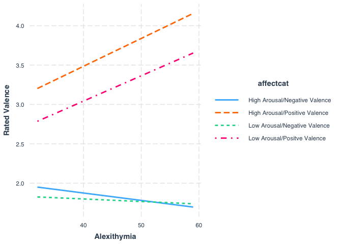
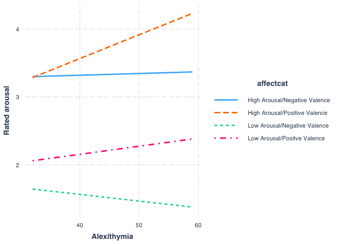

First 19 Participants
================

  - [Self Report Data](#self-report-data)
      - [Describe demographics](#describe-demographics)
      - [Affect ratings](#affect-ratings)
  - [Emotion Differentiation](#emotion-differentiation)
      - [Create list of words](#create-list-of-words)
  - [Cretae negative and postive song data sets and participant
    list](#cretae-negative-and-postive-song-data-sets-and-participant-list)
      - [Negative Stimuli](#negative-stimuli)
      - [Positive Stimuli](#positive-stimuli)
  - [Describe and Plot Valence](#describe-and-plot-valence)
  - [Describe and Plot Arousal](#describe-and-plot-arousal)

Peek at data to check range of scores and main effect of song condition.
Checking range out of concerns regarding variance for alexithymia
moderation

``` r
knitr::opts_chunk$set(echo = TRUE)
library(tidyverse)
library(readbulk)
library(psych)
library(afex)
library(knitr)
library(emmeans)
devtools::install_github("crsh/papaja")
library(sjPlot)
library(irr)
library(tableone)
devtools::install_github("ropenscilabs/gendercodeR")
library(gendercodeR)
library(interactions)
```

# Self Report Data

``` r
selfreport <- read_csv("First19Data/first19Qual.csv") 
selfreport <- genderRecode(input=selfreport,
                           genderColName = "gender", 
                           method = "narrow",
                           outputColName = "gender_recode", 
                           missingValuesObjectName = NA,
                           customDictionary = data.frame(stringsAsFactors=FALSE,
       Input = c("girl/female"),
      Output = c("female")))

selfreport <- selfreport %>% filter (id < 20)
print(nrow(selfreport))
```

    ## [1] 19

## Describe demographics

``` r
selfreport %>% select(age, musichours) %>% describe() %>% kable(digits = 3)
```

|            | vars |  n |   mean |    sd | median | trimmed |   mad | min | max | range |  skew | kurtosis |    se |
| ---------- | ---: | -: | -----: | ----: | -----: | ------: | ----: | --: | --: | ----: | ----: | -------: | ----: |
| age        |    1 | 19 | 18.895 | 2.331 |     18 |  18.647 | 1.483 |  17 |  25 |     8 | 1.093 |    0.249 | 0.535 |
| musichours |    2 | 19 |  3.737 | 1.727 |      4 |   3.765 | 2.965 |   1 |   6 |     5 | 0.018 |  \-1.376 | 0.396 |

``` r
selfreport <- selfreport %>% mutate(yearsplay = as.factor(yearsplay) %>% recode("6" = "5+"))
CreateTableOne(vars = c("gender_recode", "yearsplay"), data = selfreport) %>% kableone()
```

|                           | Overall   |
| ------------------------- | :-------- |
| n                         | 19        |
| gender\_recode = male (%) | 2 (10.5)  |
| yearsplay (%)             |           |
| 0                         | 4 (21.1)  |
| 1                         | 1 ( 5.3)  |
| 2                         | 1 ( 5.3)  |
| 3                         | 2 (10.5)  |
| 5+                        | 11 (57.9) |

\#\#Create scores \#\#\#Alexithymia

``` r
selfreport <- selfreport %>% mutate(tas_4r = 6 - .$tas_4, #Reverse code items
                                    tas_5r = 6 - .$tas_5,
                                    tas_10r = 6 - .$tas_10,
                                    tas_18r = 6 - .$tas_18,
                                    tas_19r = 6 - .$tas_19)
EOTlist <- c("tas_5r", "tas_8", "tas_10r", "tas_15", "tas_16", "tas_18r", "tas_19r", "tas_20")
DDFlist <- c("tas_2", "tas_4r", "tas_11", "tas_12", "tas_17")
DIFlist <- c("tas_1", "tas_3", "tas_6", "tas_7", "tas_9", "tas_13", "tas_14")

tas <- selfreport %>% transmute(participant = .$id,
                                EOT = select(., EOTlist) %>% rowSums(),
                                DDF = select(., DDFlist) %>% rowSums(),
                                DIF = select(.,DIFlist) %>% rowSums(),
                                TAS = select(., EOT, DDF, DIF) %>% rowSums())

alpha(select(selfreport, EOTlist))$total$std.alpha
```

    ## Some items ( tas_8 tas_10r ) were negatively correlated with the total scale and 
    ## probably should be reversed.  
    ## To do this, run the function again with the 'check.keys=TRUE' option

    ## [1] 0.3809204

``` r
alpha(select(selfreport, DDFlist))$total$std.alpha
```

    ## [1] 0.8022894

``` r
alpha(select(selfreport, DIFlist))$total$std.alpha
```

    ## [1] 0.8907239

\#\#\#DASS

``` r
# S (Stress) Q1, 6, 8, 11, 12, 14, 18
# A (Anxiety) Q2, 4, 7, 9, 15, 19, 20
# D (Depression) Q3, 5, 10, 13, 16, 17, 21 

stresslist <- c("DASS_1", "DASS_6", "DASS_8", "DASS_11", "DASS_12", "DASS_14", "DASS_18")
anxietylist <- c("DASS_2", "DASS_4", "DASS_7", "DASS_9", "DASS_15", "DASS_19", "DASS_20")
depressionlist <- c("DASS_3", "DASS_5", "DASS_10", "DASS_13", "DASS_16", "DASS_17", "DASS_21")

dass <- selfreport %>% transmute(participant = .$id,
                                 stress = select(selfreport, stresslist) %>% rowSums(),
                            anxiety = select(selfreport,anxietylist) %>% rowSums(),
                            depression = select(selfreport,depressionlist) %>% rowSums())

alpha(select(selfreport, stresslist))$total$std.alpha
```

    ## Warning in alpha(select(selfreport, stresslist)): Some items were negatively correlated with the total scale and probably 
    ## should be reversed.  
    ## To do this, run the function again with the 'check.keys=TRUE' option

    ## Some items ( DASS_18 ) were negatively correlated with the total scale and 
    ## probably should be reversed.  
    ## To do this, run the function again with the 'check.keys=TRUE' option

    ## [1] 0.6738721

``` r
alpha(select(selfreport, anxietylist))$total$std.alpha
```

    ## [1] 0.8125129

``` r
alpha(select(selfreport, depressionlist))$total$std.alpha
```

    ## [1] 0.8116102

\#\#Join scores

``` r
scores <- full_join(dass, tas, by = "participant")
scores %>% select(-participant) %>% describe() %>% kable(digits = 2)
```

|            | vars |  n |  mean |   sd | median | trimmed |  mad | min | max | range | skew | kurtosis |   se |
| ---------- | ---: | -: | ----: | ---: | -----: | ------: | ---: | --: | --: | ----: | ---: | -------: | ---: |
| stress     |    1 | 19 |  6.84 | 3.59 |      6 |    6.71 | 2.97 |   2 |  14 |    12 | 0.65 |   \-0.66 | 0.82 |
| anxiety    |    2 | 19 |  4.74 | 4.45 |      5 |    4.24 | 4.45 |   0 |  18 |    18 | 1.31 |     1.56 | 1.02 |
| depression |    3 | 19 |  4.21 | 3.44 |      4 |    3.88 | 2.97 |   0 |  14 |    14 | 1.02 |     0.93 | 0.79 |
| EOT        |    4 | 19 | 17.26 | 3.16 |     17 |   17.12 | 2.97 |  12 |  25 |    13 | 0.28 |     0.05 | 0.72 |
| DDF        |    5 | 19 | 14.32 | 4.73 |     14 |   14.29 | 5.93 |   6 |  23 |    17 | 0.03 |   \-1.17 | 1.08 |
| DIF        |    6 | 19 | 17.26 | 6.02 |     16 |   16.94 | 7.41 |   9 |  31 |    22 | 0.47 |   \-0.70 | 1.38 |
| TAS        |    7 | 19 | 46.74 | 7.78 |     46 |   46.88 | 5.93 |  32 |  59 |    27 | 0.16 |   \-0.98 | 1.78 |

\#Data Wrangle \#\#Load in Data

``` r
raw <- readbulk::read_bulk(directory = "First19Data", fun = read_csv)

raw <- unite(raw, 
             trialunique,
             participant, songmark, songtrials.thisRepN,
             remove = FALSE)

raw <- raw %>% mutate(.,
                      affectcat = as.factor(recode(affectcat,
                                                   "1" = "High Arousal/Positive Valence",
                                                   "2" = "High Arousal/Negative Valence",
                                                   "3" = "Low Arousal/Negative Valence",
                                                   "4" = "Low Arousal/Positve Valence")),
                      arousal = as.factor(recode(arousal, 
                                                 "1" = "Low",
                                                 "2" = "high")),
                      valence = as.factor(recode(valence,
                                                 "1" = "Negative",
                                                 "2" = "Positive")),
                      participant = as.numeric(participant))

#remove practice trial
filtered <- raw %>% filter(!is.na(song) & !(is.na(Instruction)))

filtered <- filtered %>% select(participant,
                                trialunique,
                                Word,
                                songmark,
                                valence,
                                arousal,
                                affectcat,
                                arousalkey.keys,
                                valencekey.keys,
                                likekey.keys,
                                WordResponse.keys) 
```

\#Data Wrangling Emotion words

``` r
forspread <- filtered %>% filter (WordResponse.keys > 0) %>% select(trialunique,
                                                                    Word,
                                                                    WordResponse.keys)


spread <- forspread %>% spread(key = Word, value = WordResponse.keys)
```

## Affect ratings

``` r
affectrating <- filtered %>% filter(!is.na(arousalkey.keys)) %>% select(trialunique,
                                                              participant,
                                                              songmark,
                                                              affectcat, 
                                                              valence,
                                                              arousal,
                                                              valencekey.keys,
                                                              arousalkey.keys)
```

\#\#Merge affect and emotion ratings

``` r
joinedaffectemo <- full_join(affectrating, spread, 
                    by = "trialunique") 
```

\#\#Merge with questioniarre responses

``` r
joined <- full_join(joinedaffectemo, scores,
                    by = "participant")
```

# Emotion Differentiation

## Create list of words

``` r
poslist <- c("ACTIVE", "ALERT", "EXCITED", "HAPPY", "TENDER") #CHECK ALERT
neglist <- c("ANGRY", "ANXIOUS", "ASHAMED", "FRUSTRATED", "GUILTY", "SAD", "SCARED")
```

# Cretae negative and postive song data sets and participant list

``` r
negstim <- joinedaffectemo %>% filter(valence == "Negative")
posstim <- joinedaffectemo %>% filter(valence == "Positive")

participant <- (unique(joinedaffectemo$participant)) 
```

## Negative Stimuli

``` r
icc_list_negstim=NULL
for(i in participant){
  participant_select <- filter(negstim, participant == i)
  stim_select <- select(participant_select, neglist)
  icc <- irr::icc(stim_select, model = "twoway", unit = "average")
  icc_temp <- icc$value
  fz_iccTemp <- fisherz(icc_temp)
  row_temp <- c(i, icc_temp, fz_iccTemp)
  icc_list_negstim=rbind(icc_list_negstim,row_temp)
  print(icc_temp)
} 
```

    ## [1] 0.5094679
    ## [1] -0.6434655
    ## [1] 0.6722371
    ## [1] 0.1793532

    ## Warning in log((1 + rho)/(1 - rho)): NaNs produced

    ## [1] -2.090909
    ## [1] -0.005516154

    ## Warning in log((1 + rho)/(1 - rho)): NaNs produced

    ## [1] -1.407292
    ## [1] 0.07157464
    ## [1] -0.8364253

    ## Warning in log((1 + rho)/(1 - rho)): NaNs produced

    ## [1] -2.553704
    ## [1] -0.1579861

    ## Warning in log((1 + rho)/(1 - rho)): NaNs produced

    ## [1] -2.247706
    ## [1] 0.6989323
    ## [1] -0.495851
    ## [1] -0.6609543
    ## [1] -0.5736111
    ## [1] 0.4190141
    ## [1] -0.1329114
    ## [1] -0.3288399

``` r
colnames(icc_list_negstim)=c("participant","ICCneg","ICCneg_fz")
icc_list_negstim=as.data.frame(icc_list_negstim)
```

## Positive Stimuli

``` r
icc_list_posstim=NULL
for(i in participant){
  participant_select <- filter(posstim, participant == i)
  stim_select <- select(participant_select, neglist)
  icc <- irr::icc(stim_select, model = "twoway", unit = "average")
  icc_temp <- icc$value
  fz_iccTemp <- fisherz(icc_temp)
  row_temp <- c(i, icc_temp, fz_iccTemp)
  icc_list_posstim=rbind(icc_list_posstim,row_temp)
  print(icc_temp)
} 
```

    ## [1] 0.7578063
    ## [1] -0.2062016
    ## [1] 1.82146e-16
    ## [1] 0.6635152
    ## [1] 0
    ## [1] 0.5089869
    ## [1] 0.4153578
    ## [1] 0.122807
    ## [1] 0.09494001
    ## [1] 0.6846751
    ## [1] 0.8687179
    ## [1] 0.8799747
    ## [1] 0.1416667
    ## [1] 0.1469816
    ## [1] 0.1233974
    ## [1] 0.01046338
    ## [1] 0.776427
    ## [1] 0.6484434
    ## [1] 0.5528455

``` r
colnames(icc_list_posstim)=c("participant","ICCpos","ICCpos_fz")
icc_list_posstim=as.data.frame(icc_list_posstim)
```

\#Join ICC, make values inverse and mark negative (negative scores
cannot be interpreted)

``` r
joinedICC <- full_join(icc_list_posstim, icc_list_negstim, by = "participant")  %>% full_join(scores, by = "participant")

joinedICC <- joinedICC %>% mutate (ICCneg_keep = if_else(condition = joinedICC$ICCneg > 0,
                                                          true = "Positive",
                                                          false = "Ignore",
                                                          missing = "Ignore"),
                                    ICCpos_keep = if_else(condition = joinedICC$ICCpos > 0,
                                                          true = "Positive",
                                                          false = "Ignore",
                                                          missing = "Ignore"),
                                    ICCneg_r = 1 - joinedICC$ICCneg,
                                    ICCneg_fz_r = -1* joinedICC$ICCneg_fz,
                                    ICCpos_r = 1 - joinedICC$ICCpos,
                                    ICCpos_fz_r = -1* joinedICC$ICCpos_fz)  
```

# Describe and Plot Valence

``` r
valencemodel <- afex::mixed(formula = valencekey.keys~affectcat*TAS + (1 |songmark) +(affectcat |participant), data = joined, return = "merMod") 
```

    ## Contrasts set to contr.sum for the following variables: affectcat

    ## Numerical variables NOT centered on 0: TAS
    ## If in interactions, interpretation of lower order (e.g., main) effects difficult.

    ## Warning in checkConv(attr(opt, "derivs"), opt$par, ctrl =
    ## control$checkConv, : Model failed to converge with max|grad| = 0.00409274
    ## (tol = 0.002, component 1)

``` r
tab_model(valencemodel)
```

    ## Caution! ICC for random-slope-intercept models usually not meaningful. Use `adjusted = TRUE` to use the mean random effect variance to calculate the ICC. See 'Note' in `?icc`.

<table style="border-collapse:collapse; border:none;">

<tr>

<th style="border-top: double; text-align:center; font-style:normal; font-weight:bold; padding:0.2cm;  text-align:left; ">

 

</th>

<th colspan="3" style="border-top: double; text-align:center; font-style:normal; font-weight:bold; padding:0.2cm; ">

valencekey keys

</th>

</tr>

<tr>

<td style=" text-align:center; border-bottom:1px solid; font-style:italic; font-weight:normal;  text-align:left; ">

Predictors

</td>

<td style=" text-align:center; border-bottom:1px solid; font-style:italic; font-weight:normal;  ">

Estimates

</td>

<td style=" text-align:center; border-bottom:1px solid; font-style:italic; font-weight:normal;  ">

CI

</td>

<td style=" text-align:center; border-bottom:1px solid; font-style:italic; font-weight:normal;  ">

p

</td>

</tr>

<tr>

<td style=" padding:0.2cm; text-align:left; vertical-align:top; text-align:left; ">

(Intercept)

</td>

<td style=" padding:0.2cm; text-align:left; vertical-align:top; text-align:center;  ">

2.00

</td>

<td style=" padding:0.2cm; text-align:left; vertical-align:top; text-align:center;  ">

0.46 – 3.55

</td>

<td style=" padding:0.2cm; text-align:left; vertical-align:top; text-align:center;  ">

<strong>0.021</strong>

</td>

</tr>

<tr>

<td style=" padding:0.2cm; text-align:left; vertical-align:top; text-align:left; ">

affectcat1

</td>

<td style=" padding:0.2cm; text-align:left; vertical-align:top; text-align:center;  ">

0.25

</td>

<td style=" padding:0.2cm; text-align:left; vertical-align:top; text-align:center;  ">

\-1.01 – 1.51

</td>

<td style=" padding:0.2cm; text-align:left; vertical-align:top; text-align:center;  ">

0.703

</td>

</tr>

<tr>

<td style=" padding:0.2cm; text-align:left; vertical-align:top; text-align:left; ">

affectcat2

</td>

<td style=" padding:0.2cm; text-align:left; vertical-align:top; text-align:center;  ">

0.07

</td>

<td style=" padding:0.2cm; text-align:left; vertical-align:top; text-align:center;  ">

\-1.23 – 1.37

</td>

<td style=" padding:0.2cm; text-align:left; vertical-align:top; text-align:center;  ">

0.918

</td>

</tr>

<tr>

<td style=" padding:0.2cm; text-align:left; vertical-align:top; text-align:left; ">

affectcat3

</td>

<td style=" padding:0.2cm; text-align:left; vertical-align:top; text-align:center;  ">

\-0.07

</td>

<td style=" padding:0.2cm; text-align:left; vertical-align:top; text-align:center;  ">

\-1.26 – 1.11

</td>

<td style=" padding:0.2cm; text-align:left; vertical-align:top; text-align:center;  ">

0.904

</td>

</tr>

<tr>

<td style=" padding:0.2cm; text-align:left; vertical-align:top; text-align:left; ">

TAS

</td>

<td style=" padding:0.2cm; text-align:left; vertical-align:top; text-align:center;  ">

0.01

</td>

<td style=" padding:0.2cm; text-align:left; vertical-align:top; text-align:center;  ">

\-0.02 – 0.05

</td>

<td style=" padding:0.2cm; text-align:left; vertical-align:top; text-align:center;  ">

0.420

</td>

</tr>

<tr>

<td style=" padding:0.2cm; text-align:left; vertical-align:top; text-align:left; ">

affectcat1:TAS

</td>

<td style=" padding:0.2cm; text-align:left; vertical-align:top; text-align:center;  ">

\-0.02

</td>

<td style=" padding:0.2cm; text-align:left; vertical-align:top; text-align:center;  ">

\-0.05 – 0.00

</td>

<td style=" padding:0.2cm; text-align:left; vertical-align:top; text-align:center;  ">

0.102

</td>

</tr>

<tr>

<td style=" padding:0.2cm; text-align:left; vertical-align:top; text-align:left; ">

affectcat2:TAS

</td>

<td style=" padding:0.2cm; text-align:left; vertical-align:top; text-align:center;  ">

0.02

</td>

<td style=" padding:0.2cm; text-align:left; vertical-align:top; text-align:center;  ">

\-0.01 – 0.05

</td>

<td style=" padding:0.2cm; text-align:left; vertical-align:top; text-align:center;  ">

0.136

</td>

</tr>

<tr>

<td style=" padding:0.2cm; text-align:left; vertical-align:top; text-align:left; ">

affectcat3:TAS

</td>

<td style=" padding:0.2cm; text-align:left; vertical-align:top; text-align:center;  ">

\-0.02

</td>

<td style=" padding:0.2cm; text-align:left; vertical-align:top; text-align:center;  ">

\-0.04 – 0.01

</td>

<td style=" padding:0.2cm; text-align:left; vertical-align:top; text-align:center;  ">

0.196

</td>

</tr>

<tr>

<td colspan="4" style="font-weight:bold; text-align:left; padding-top:.8em;">

Random Effects

</td>

</tr>

<tr>

<td style=" padding:0.2cm; text-align:left; vertical-align:top; text-align:left; padding-top:0.1cm; padding-bottom:0.1cm;">

σ<sup>2</sup>

</td>

<td style=" padding:0.2cm; text-align:left; vertical-align:top; padding-top:0.1cm; padding-bottom:0.1cm; text-align:left;" colspan="3">

0.51

</td>

<tr>

<td style=" padding:0.2cm; text-align:left; vertical-align:top; text-align:left; padding-top:0.1cm; padding-bottom:0.1cm;">

τ<sub>00</sub> <sub>participant</sub>

</td>

<td style=" padding:0.2cm; text-align:left; vertical-align:top; padding-top:0.1cm; padding-bottom:0.1cm; text-align:left;" colspan="3">

0.28

</td>

<tr>

<td style=" padding:0.2cm; text-align:left; vertical-align:top; text-align:left; padding-top:0.1cm; padding-bottom:0.1cm;">

τ<sub>00</sub> <sub>songmark</sub>

</td>

<td style=" padding:0.2cm; text-align:left; vertical-align:top; padding-top:0.1cm; padding-bottom:0.1cm; text-align:left;" colspan="3">

0.07

</td>

<tr>

<td style=" padding:0.2cm; text-align:left; vertical-align:top; text-align:left; padding-top:0.1cm; padding-bottom:0.1cm;">

τ<sub>11</sub> <sub>participant.affectcat1</sub>

</td>

<td style=" padding:0.2cm; text-align:left; vertical-align:top; padding-top:0.1cm; padding-bottom:0.1cm; text-align:left;" colspan="3">

0.15

</td>

<tr>

<td style=" padding:0.2cm; text-align:left; vertical-align:top; text-align:left; padding-top:0.1cm; padding-bottom:0.1cm;">

τ<sub>11</sub> <sub>participant.affectcat2</sub>

</td>

<td style=" padding:0.2cm; text-align:left; vertical-align:top; padding-top:0.1cm; padding-bottom:0.1cm; text-align:left;" colspan="3">

0.16

</td>

<tr>

<td style=" padding:0.2cm; text-align:left; vertical-align:top; text-align:left; padding-top:0.1cm; padding-bottom:0.1cm;">

τ<sub>11</sub> <sub>participant.affectcat3</sub>

</td>

<td style=" padding:0.2cm; text-align:left; vertical-align:top; padding-top:0.1cm; padding-bottom:0.1cm; text-align:left;" colspan="3">

0.12

</td>

<tr>

<td style=" padding:0.2cm; text-align:left; vertical-align:top; text-align:left; padding-top:0.1cm; padding-bottom:0.1cm;">

ρ<sub>01</sub> <sub>participant.affectcat1</sub>

</td>

<td style=" padding:0.2cm; text-align:left; vertical-align:top; padding-top:0.1cm; padding-bottom:0.1cm; text-align:left;" colspan="3">

0.20

</td>

<tr>

<td style=" padding:0.2cm; text-align:left; vertical-align:top; text-align:left; padding-top:0.1cm; padding-bottom:0.1cm;">

ρ<sub>01</sub> <sub>participant.affectcat2</sub>

</td>

<td style=" padding:0.2cm; text-align:left; vertical-align:top; padding-top:0.1cm; padding-bottom:0.1cm; text-align:left;" colspan="3">

\-0.25

</td>

<tr>

<td style=" padding:0.2cm; text-align:left; vertical-align:top; text-align:left; padding-top:0.1cm; padding-bottom:0.1cm;">

ρ<sub>01</sub> <sub>participant.affectcat3</sub>

</td>

<td style=" padding:0.2cm; text-align:left; vertical-align:top; padding-top:0.1cm; padding-bottom:0.1cm; text-align:left;" colspan="3">

0.14

</td>

<tr>

<td style=" padding:0.2cm; text-align:left; vertical-align:top; text-align:left; padding-top:0.1cm; padding-bottom:0.1cm;">

ICC <sub>participant</sub>

</td>

<td style=" padding:0.2cm; text-align:left; vertical-align:top; padding-top:0.1cm; padding-bottom:0.1cm; text-align:left;" colspan="3">

0.33

</td>

<tr>

<td style=" padding:0.2cm; text-align:left; vertical-align:top; text-align:left; padding-top:0.1cm; padding-bottom:0.1cm;">

ICC <sub>songmark</sub>

</td>

<td style=" padding:0.2cm; text-align:left; vertical-align:top; padding-top:0.1cm; padding-bottom:0.1cm; text-align:left;" colspan="3">

0.08

</td>

<tr>

<td style=" padding:0.2cm; text-align:left; vertical-align:top; text-align:left; padding-top:0.1cm; padding-bottom:0.1cm; border-top:1px solid;">

Observations

</td>

<td style=" padding:0.2cm; text-align:left; vertical-align:top; padding-top:0.1cm; padding-bottom:0.1cm; text-align:left; border-top:1px solid;" colspan="3">

602

</td>

</tr>

<tr>

<td style=" padding:0.2cm; text-align:left; vertical-align:top; text-align:left; padding-top:0.1cm; padding-bottom:0.1cm;">

Marginal R<sup>2</sup> / Conditional R<sup>2</sup>

</td>

<td style=" padding:0.2cm; text-align:left; vertical-align:top; padding-top:0.1cm; padding-bottom:0.1cm; text-align:left;" colspan="3">

0.436 / 0.714

</td>

</tr>

</table>

``` r
plot_model(valencemodel, type = "pred")$affectcat 
```

<!-- -->

``` r
emmeans(valencemodel, "affectcat") %>% pairs() %>% kable(caption = "Pairwise comparisons of main effect of song affect category for valence ratings", digits = 3)
```

    ## NOTE: Results may be misleading due to involvement in interactions

| contrast                                                      | estimate |    SE |     df | t.ratio | p.value |
| :------------------------------------------------------------ | -------: | ----: | -----: | ------: | ------: |
| High Arousal/Negative Valence - High Arousal/Positive Valence |  \-1.911 | 0.249 | 21.098 | \-7.661 |   0.000 |
| High Arousal/Negative Valence - Low Arousal/Negative Valence  |    0.034 | 0.223 | 16.398 |   0.152 |   0.999 |
| High Arousal/Negative Valence - Low Arousal/Positve Valence   |  \-1.448 | 0.265 | 23.033 | \-5.455 |   0.000 |
| High Arousal/Positive Valence - Low Arousal/Negative Valence  |    1.945 | 0.262 | 22.686 |   7.423 |   0.000 |
| High Arousal/Positive Valence - Low Arousal/Positve Valence   |    0.464 | 0.233 | 18.408 |   1.990 |   0.228 |
| Low Arousal/Negative Valence - Low Arousal/Positve Valence    |  \-1.482 | 0.243 | 20.172 | \-6.088 |   0.000 |

Pairwise comparisons of main effect of song affect category for valence
ratings

``` r
interact_plot(model = valencemodel,
              pred = TAS,
              modx = affectcat,
              x.label = "Alexithymia",
              y.label = "Rated Valence")
```

<!-- -->

# Describe and Plot Arousal

``` r
arousalmodel <- afex::mixed(formula = arousalkey.keys~affectcat*TAS + (1 |songmark) +(affectcat |participant), data = joined, return = "merMod") 
```

    ## Contrasts set to contr.sum for the following variables: affectcat

    ## Numerical variables NOT centered on 0: TAS
    ## If in interactions, interpretation of lower order (e.g., main) effects difficult.

    ## Warning in checkConv(attr(opt, "derivs"), opt$par, ctrl =
    ## control$checkConv, : Model failed to converge with max|grad| = 0.00365187
    ## (tol = 0.002, component 1)

``` r
tab_model(arousalmodel)
```

    ## Caution! ICC for random-slope-intercept models usually not meaningful. Use `adjusted = TRUE` to use the mean random effect variance to calculate the ICC. See 'Note' in `?icc`.

<table style="border-collapse:collapse; border:none;">

<tr>

<th style="border-top: double; text-align:center; font-style:normal; font-weight:bold; padding:0.2cm;  text-align:left; ">

 

</th>

<th colspan="3" style="border-top: double; text-align:center; font-style:normal; font-weight:bold; padding:0.2cm; ">

arousalkey keys

</th>

</tr>

<tr>

<td style=" text-align:center; border-bottom:1px solid; font-style:italic; font-weight:normal;  text-align:left; ">

Predictors

</td>

<td style=" text-align:center; border-bottom:1px solid; font-style:italic; font-weight:normal;  ">

Estimates

</td>

<td style=" text-align:center; border-bottom:1px solid; font-style:italic; font-weight:normal;  ">

CI

</td>

<td style=" text-align:center; border-bottom:1px solid; font-style:italic; font-weight:normal;  ">

p

</td>

</tr>

<tr>

<td style=" padding:0.2cm; text-align:left; vertical-align:top; text-align:left; ">

(Intercept)

</td>

<td style=" padding:0.2cm; text-align:left; vertical-align:top; text-align:center;  ">

2.25

</td>

<td style=" padding:0.2cm; text-align:left; vertical-align:top; text-align:center;  ">

0.79 – 3.72

</td>

<td style=" padding:0.2cm; text-align:left; vertical-align:top; text-align:center;  ">

<strong>0.008</strong>

</td>

</tr>

<tr>

<td style=" padding:0.2cm; text-align:left; vertical-align:top; text-align:left; ">

affectcat1

</td>

<td style=" padding:0.2cm; text-align:left; vertical-align:top; text-align:center;  ">

0.96

</td>

<td style=" padding:0.2cm; text-align:left; vertical-align:top; text-align:center;  ">

\-0.67 – 2.59

</td>

<td style=" padding:0.2cm; text-align:left; vertical-align:top; text-align:center;  ">

0.262

</td>

</tr>

<tr>

<td style=" padding:0.2cm; text-align:left; vertical-align:top; text-align:left; ">

affectcat2

</td>

<td style=" padding:0.2cm; text-align:left; vertical-align:top; text-align:center;  ">

\-0.09

</td>

<td style=" padding:0.2cm; text-align:left; vertical-align:top; text-align:center;  ">

\-1.23 – 1.06

</td>

<td style=" padding:0.2cm; text-align:left; vertical-align:top; text-align:center;  ">

0.881

</td>

</tr>

<tr>

<td style=" padding:0.2cm; text-align:left; vertical-align:top; text-align:left; ">

affectcat3

</td>

<td style=" padding:0.2cm; text-align:left; vertical-align:top; text-align:center;  ">

\-0.30

</td>

<td style=" padding:0.2cm; text-align:left; vertical-align:top; text-align:center;  ">

\-1.47 – 0.87

</td>

<td style=" padding:0.2cm; text-align:left; vertical-align:top; text-align:center;  ">

0.623

</td>

</tr>

<tr>

<td style=" padding:0.2cm; text-align:left; vertical-align:top; text-align:left; ">

TAS

</td>

<td style=" padding:0.2cm; text-align:left; vertical-align:top; text-align:center;  ">

0.01

</td>

<td style=" padding:0.2cm; text-align:left; vertical-align:top; text-align:center;  ">

\-0.02 – 0.04

</td>

<td style=" padding:0.2cm; text-align:left; vertical-align:top; text-align:center;  ">

0.536

</td>

</tr>

<tr>

<td style=" padding:0.2cm; text-align:left; vertical-align:top; text-align:left; ">

affectcat1:TAS

</td>

<td style=" padding:0.2cm; text-align:left; vertical-align:top; text-align:center;  ">

\-0.01

</td>

<td style=" padding:0.2cm; text-align:left; vertical-align:top; text-align:center;  ">

\-0.04 – 0.03

</td>

<td style=" padding:0.2cm; text-align:left; vertical-align:top; text-align:center;  ">

0.676

</td>

</tr>

<tr>

<td style=" padding:0.2cm; text-align:left; vertical-align:top; text-align:left; ">

affectcat2:TAS

</td>

<td style=" padding:0.2cm; text-align:left; vertical-align:top; text-align:center;  ">

0.03

</td>

<td style=" padding:0.2cm; text-align:left; vertical-align:top; text-align:center;  ">

0.00 – 0.05

</td>

<td style=" padding:0.2cm; text-align:left; vertical-align:top; text-align:center;  ">

0.052

</td>

</tr>

<tr>

<td style=" padding:0.2cm; text-align:left; vertical-align:top; text-align:left; ">

affectcat3:TAS

</td>

<td style=" padding:0.2cm; text-align:left; vertical-align:top; text-align:center;  ">

\-0.02

</td>

<td style=" padding:0.2cm; text-align:left; vertical-align:top; text-align:center;  ">

\-0.04 – 0.00

</td>

<td style=" padding:0.2cm; text-align:left; vertical-align:top; text-align:center;  ">

0.126

</td>

</tr>

<tr>

<td colspan="4" style="font-weight:bold; text-align:left; padding-top:.8em;">

Random Effects

</td>

</tr>

<tr>

<td style=" padding:0.2cm; text-align:left; vertical-align:top; text-align:left; padding-top:0.1cm; padding-bottom:0.1cm;">

σ<sup>2</sup>

</td>

<td style=" padding:0.2cm; text-align:left; vertical-align:top; padding-top:0.1cm; padding-bottom:0.1cm; text-align:left;" colspan="3">

0.47

</td>

<tr>

<td style=" padding:0.2cm; text-align:left; vertical-align:top; text-align:left; padding-top:0.1cm; padding-bottom:0.1cm;">

τ<sub>00</sub> <sub>participant</sub>

</td>

<td style=" padding:0.2cm; text-align:left; vertical-align:top; padding-top:0.1cm; padding-bottom:0.1cm; text-align:left;" colspan="3">

0.25

</td>

<tr>

<td style=" padding:0.2cm; text-align:left; vertical-align:top; text-align:left; padding-top:0.1cm; padding-bottom:0.1cm;">

τ<sub>00</sub> <sub>songmark</sub>

</td>

<td style=" padding:0.2cm; text-align:left; vertical-align:top; padding-top:0.1cm; padding-bottom:0.1cm; text-align:left;" colspan="3">

0.10

</td>

<tr>

<td style=" padding:0.2cm; text-align:left; vertical-align:top; text-align:left; padding-top:0.1cm; padding-bottom:0.1cm;">

τ<sub>11</sub> <sub>participant.affectcat1</sub>

</td>

<td style=" padding:0.2cm; text-align:left; vertical-align:top; padding-top:0.1cm; padding-bottom:0.1cm; text-align:left;" colspan="3">

0.28

</td>

<tr>

<td style=" padding:0.2cm; text-align:left; vertical-align:top; text-align:left; padding-top:0.1cm; padding-bottom:0.1cm;">

τ<sub>11</sub> <sub>participant.affectcat2</sub>

</td>

<td style=" padding:0.2cm; text-align:left; vertical-align:top; padding-top:0.1cm; padding-bottom:0.1cm; text-align:left;" colspan="3">

0.11

</td>

<tr>

<td style=" padding:0.2cm; text-align:left; vertical-align:top; text-align:left; padding-top:0.1cm; padding-bottom:0.1cm;">

τ<sub>11</sub> <sub>participant.affectcat3</sub>

</td>

<td style=" padding:0.2cm; text-align:left; vertical-align:top; padding-top:0.1cm; padding-bottom:0.1cm; text-align:left;" colspan="3">

0.12

</td>

<tr>

<td style=" padding:0.2cm; text-align:left; vertical-align:top; text-align:left; padding-top:0.1cm; padding-bottom:0.1cm;">

ρ<sub>01</sub> <sub>participant.affectcat1</sub>

</td>

<td style=" padding:0.2cm; text-align:left; vertical-align:top; padding-top:0.1cm; padding-bottom:0.1cm; text-align:left;" colspan="3">

0.37

</td>

<tr>

<td style=" padding:0.2cm; text-align:left; vertical-align:top; text-align:left; padding-top:0.1cm; padding-bottom:0.1cm;">

ρ<sub>01</sub> <sub>participant.affectcat2</sub>

</td>

<td style=" padding:0.2cm; text-align:left; vertical-align:top; padding-top:0.1cm; padding-bottom:0.1cm; text-align:left;" colspan="3">

\-0.58

</td>

<tr>

<td style=" padding:0.2cm; text-align:left; vertical-align:top; text-align:left; padding-top:0.1cm; padding-bottom:0.1cm;">

ρ<sub>01</sub> <sub>participant.affectcat3</sub>

</td>

<td style=" padding:0.2cm; text-align:left; vertical-align:top; padding-top:0.1cm; padding-bottom:0.1cm; text-align:left;" colspan="3">

\-0.39

</td>

<tr>

<td style=" padding:0.2cm; text-align:left; vertical-align:top; text-align:left; padding-top:0.1cm; padding-bottom:0.1cm;">

ICC <sub>participant</sub>

</td>

<td style=" padding:0.2cm; text-align:left; vertical-align:top; padding-top:0.1cm; padding-bottom:0.1cm; text-align:left;" colspan="3">

0.31

</td>

<tr>

<td style=" padding:0.2cm; text-align:left; vertical-align:top; text-align:left; padding-top:0.1cm; padding-bottom:0.1cm;">

ICC <sub>songmark</sub>

</td>

<td style=" padding:0.2cm; text-align:left; vertical-align:top; padding-top:0.1cm; padding-bottom:0.1cm; text-align:left;" colspan="3">

0.12

</td>

<tr>

<td style=" padding:0.2cm; text-align:left; vertical-align:top; text-align:left; padding-top:0.1cm; padding-bottom:0.1cm; border-top:1px solid;">

Observations

</td>

<td style=" padding:0.2cm; text-align:left; vertical-align:top; padding-top:0.1cm; padding-bottom:0.1cm; text-align:left; border-top:1px solid;" colspan="3">

602

</td>

</tr>

<tr>

<td style=" padding:0.2cm; text-align:left; vertical-align:top; text-align:left; padding-top:0.1cm; padding-bottom:0.1cm;">

Marginal R<sup>2</sup> / Conditional R<sup>2</sup>

</td>

<td style=" padding:0.2cm; text-align:left; vertical-align:top; padding-top:0.1cm; padding-bottom:0.1cm; text-align:left;" colspan="3">

0.466 / 0.742

</td>

</tr>

</table>

``` r
plot_model(arousalmodel, type = "pred")$affectcat 
```

<!-- -->

``` r
emmeans(arousalmodel, "affectcat") %>% pairs() %>% kable(caption = "Pairwise comparisons of main effect of song affect category for arousal ratings", digits = 3)
```

    ## NOTE: Results may be misleading due to involvement in interactions

| contrast                                                      | estimate |    SE |     df | t.ratio | p.value |
| :------------------------------------------------------------ | -------: | ----: | -----: | ------: | ------: |
| High Arousal/Negative Valence - High Arousal/Positive Valence |  \-0.465 | 0.301 | 22.302 | \-1.549 |   0.427 |
| High Arousal/Negative Valence - Low Arousal/Negative Valence  |    1.840 | 0.301 | 22.426 |   6.105 |   0.000 |
| High Arousal/Negative Valence - Low Arousal/Positve Valence   |    1.103 | 0.285 | 20.080 |   3.867 |   0.005 |
| High Arousal/Positive Valence - Low Arousal/Negative Valence  |    2.306 | 0.265 | 16.525 |   8.710 |   0.000 |
| High Arousal/Positive Valence - Low Arousal/Positve Valence   |    1.568 | 0.258 | 15.185 |   6.088 |   0.000 |
| Low Arousal/Negative Valence - Low Arousal/Positve Valence    |  \-0.738 | 0.259 | 15.529 | \-2.845 |   0.053 |

Pairwise comparisons of main effect of song affect category for arousal
ratings

``` r
interact_plot(model = arousalmodel,
              pred = TAS,
              modx = affectcat,
              x.label = "Alexithymia",
              y.label = "Rated arousal")
```

<!-- -->
